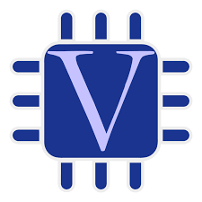

# Hamed Musleh

`Computer Engineer`

[](https://www.facebook.com/share/1C3ZycWVQM/?mibextid=wwXIfr)
[](https://github.com/HamedMusleh)
[](https://www.instagram.com/hamed.musleh?igsh=MXVmem15bDhlZDVsMA%3D%3D&utm_source=qr)

---

## 🛠️ Languages and Tools:

<p align="left">
  
  
  
  
  
  
  
  
</p>

---

## 📈 GitHub Stats


- 🔄 **Total Contributions (Last Year)**: 34  
- 📁 **Most Used Languages** (approximate):

---

## 📊 Most Used Languages

```text
C              ████████████████████████████████ 80
Verilog        ██████████████████████████       65
Python         ██████████████████████            60
Java           ███████████████                   40
HTML/CSS/JS    ███████████████                   40
